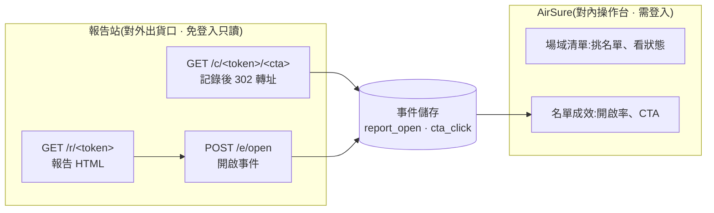

# AirCare 首批報告寄送計畫（目標 2026-09-18）

| 項目 | 內容 |
|---|---|
| **建立／更新** | 2026-09-08 |
| **範圍** | 手動挑選 **30–60 位客戶**，以 HTML 連結形式寄出 AirCare 空氣健康報告，並追蹤開啟與 CTA 互動 |
| **通路** | **LINE OA · 簡訊 · Email**（沒有 LINE 的走簡訊 + Email） |
| **報告產出** | **由另一個 AI Agent 產生**每位客戶的 md 或 HTML（格式未定，見 §5） |
| **本文性質** | **給接手工程師的交接規格**。第 §3、§4 是必須滿足的需求，平台選型由工程團隊決定 |

**相關文件**
- `docs/dispatch-data-model-spec.md` — 寄發事件模型（12 項決策已定案）
- `docs/aircare-v2-分群與評分機制.md` — 分群與評分的權威規格
- `docs/ report/aircare-architecture_1.md` — 快照牆架構（三條已拍板決策）
- `docs/中台串接與工作流說明.md` — Salesforce ↔ 中台 ↔ AirSure 的串接

---

## 〇、環境定位（先講清楚，避免誤會）

| 環境 | 網址 | 性質 |
|---|---|---|
| AirSure 現況 | `airsure-c3k.pages.dev` | ⚠ **開發測試用**。Cloudflare Pages 免費網域，push `main` 自動部署，無驗證、無環境分離 |
| AirSure 正式 | 待定 | **由工程師重新部署**，使用正式環境與正式網域 |
| 報告站 | 待定 | **全新建置**，見 §3、§4 |

> **本文不假設沿用現有測試站。** 現有站的價值是「規格已經被做出來、可以看」，不是「拿來上線」。
> 文中提到 Cloudflare 的地方一律是**參考實作**，不是選型結論。

---

## 一、⚠ 前置阻斷：報告的總分現在是錯的

**這件事優先於所有工程項目。** 依《aircare-v2-分群與評分機制》驗算三份實際報告：

| 設備 | 平均 PM2.5 | 平均濕度 | 報告封面總分 | **依 v2 應為** | 差 | 封面分群 |
|---|---:|---:|---:|---:|---:|---|
| `8065998dcaf0` | 3.6 | 59.5% | 45.3（濕度 **0.0**） | **95.3**（濕度 100） | **−50.0** | 金級空氣 |
| `806599927630` | 2.5 | 46.8% | 46.4（濕度 **0.0**） | **96.4**（濕度 100） | **−50.0** | 金級空氣 |
| `1cdbd4f8def8` | 1.4 | 55.5% | 47.6（濕度 **0.0**） | **97.6**（濕度 100） | **−50.0** | 金級空氣 |

### 診斷：只有評分的濕度項壞掉，分群是對的

v2 §2 明定**分群與評分分離**，兩者吃同樣的兩個平均值但走不同規則。驗算結果正好印證：

- **分群正確** — 三台都是 PM2.5 ≤5（P1）× 濕度 45–60%（H1）→ 依 v2 §3.4 矩陣就是**金級空氣** ✅
- **評分錯誤** — 三台的平均濕度全落在 v2 §4.2 的 `45% < h <= 60% → 100 分` 區間，卻輸出 `0.0` ❌

**差正好都是 50.0 分**，因為 v2 §4 的權重是 `濕度分數 × 0.5`：濕度該得 100 卻給 0，總分就固定少 50。這不是計算誤差，是**濕度指數回傳 0 而非實際值**。

> 另有第四台（MAC `1cdbd4f6ac40`，平均濕度 66.0%）同樣輸出 `0.0` — 該台依 v2 應得 67 分（`65% < h <= 70% → 70 - (h-65)×3`）。跨濕度區間都壞，**不是單一區間的邊界問題**。

### 修哪裡

v2 §7 明定：**生效公式由 PostgreSQL `scoring_config` 表中 `active = TRUE` 的設定決定，程式執行時讀取，不以硬編碼公式為準。** 本次核對的 active 版本：

| 設定欄位 | 版本 |
|---|---:|
| `air_quality_index`（PM2.5 分數） | 9 |
| **`environmental_humidity_index`（濕度分數）** | **7** |
| `aircare_index` | 2 |

查修順序：

1. 確認 `scoring_config` 裡 `environmental_humidity_index` 的 active 列是否為版本 7、公式是否符合 v2 §4.2 的八段折線
2. 確認傳入的濕度值不是 null／未帶入（**null → 0 是最可能的失敗模式**）
3. 產生器程式碼在 **`aircare-frontend/mcp_server/tools/scoring.py`**（v2 §8 可追溯來源）

**驗收**：任一份報告的封面濕度分數，等於用 v2 §4.2 折線代入該報告「平均濕度」的結果。

### AirSure 這一側已同步修正（2026-09-08）

檯面一律用 v2 重算，報告原值保留在 `DEVICE_REPORTS.meta` 不覆寫。9/3 的 v2 對齊（`eea8a1a`）已處理場域清單與場域詳情，但漏了設備總覽／族群分析走的 `REAL_METRICS`，本次補齊 — 修正前同一台設備在不同 tab 會出現 45 分與 96 分兩個值。修正後三個出口一致（96／98／99）。

---

## 二、系統組成與職責邊界



| 元件 | 職責 | 誰建 |
|---|---|---|
| 報告產生器 | 產出每台設備一份報告內容 | AirCare 那一側（另一個 AI Agent） |
| **報告站** | 託管報告、發放 token、記錄開啟與 CTA | **本次要新建（工程師）** |
| AirSure | 挑名單、看狀態、看成效 | 已存在（測試版） |
| 數據中台 | 客戶身分（姓名由客戶編號即時換） | 已存在（本地試接） |

### 為什麼報告站不掛在數據中台底下

| 理由 | 說明 |
|---|---|
| 中台沒有資料庫 | `requirements.txt` 只有 fastapi / uvicorn / httpx，且 **0 個寫入端點**、CORS 只允許 GET |
| 中台目前不能公開 | 端點**無任何身分驗證**，誰連到 8000 埠就能查任何客戶個資 |
| 安全模型相反 | 中台是「對內、看得到全部資料」；報告站是「對外、免登入、只看得到自己那一份」 |

符合架構關係圖已拍板的三條：**對外報告採快照 · token 綁設備 · 對外免登入只讀**。

---

## 三、報告站需求規格（平台中立）

**以下是必須滿足的條件，不指定技術棧。** 工程團隊依熟悉度選型即可。

### 3.1 功能需求

| # | 需求 |
|---|---|
| F1 | 託管 30–60 份（未來上千份）靜態報告 HTML，以不可猜 token 定址 |
| F2 | 提供三個端點：`GET /r/<token>`、`GET /c/<token>/<cta_id>`、`POST /e/open` |
| F3 | `/c/` 必須**先寫入事件再 302 轉址**，且轉址目的地由設定決定（不寫死在報告內） |
| F4 | 事件可持久化儲存並可查詢／匯出（`report_open`、`cta_click`） |
| F5 | token 可設期效、可個別撤銷 |
| F6 | 記錄事件時保留原始 User-Agent 與時間戳（供事後過濾預抓取，見 §6.3） |

### 3.2 非功能需求

| # | 需求 | 為什麼 |
|---|---|---|
| N1 | **強制 HTTPS**，憑證自動續期 | 對外公開頁面 |
| N2 | 手機優先，低延遲 | 多數人在 LINE 內建瀏覽器用手機開 |
| N3 | **Rate limit／WAF** | 防止 token 被掃描枚舉 |
| N4 | 事件資料**保留 2 年**、可備份可匯出 | 對齊 Dispatch 規格的保留期限決策；季報要看去年同期 |
| N5 | 存取稽核 log | 個資合規 |
| N6 | 環境分離 dev / staging / prod，**token 不可跨環境通用** | 避免測試連結流到客戶手上 |
| N7 | 可獨立下線，不影響 AirSure | 出事時的止血手段 |

### 3.3 參考實作（三選一，由工程師決定）

| 選項 | 組成 | 適合 |
|---|---|---|
| A | Cloudflare Pages + Functions + D1 | 團隊已用 Cloudflare；零伺服器維運 |
| B | Nginx 靜態託管 + Node/Python API + PostgreSQL | 團隊熟悉傳統部署；與中台技術棧一致 |
| C | S3／GCS + CDN + Lambda／Cloud Run + 託管 DB | 已有雲端基礎建設 |

**本文不做選型結論。** 三者都能滿足 §3.1 與 §3.2。

---

## 四、網域與環境需求

### 4.1 報告站要用**獨立網域或子網域**，不要掛在 AirSure 底下

| 理由 | 說明 |
|---|---|
| 安全模型相反 | AirSure 之後會加驗證／SSO；報告站必須維持免登入，掛一起會互相打架 |
| 可獨立下線 | 報告站出問題時不該連帶影響對內系統 |
| Cookie／儲存隔離 | 同網域會共用 cookie 作用域，對外頁面不該碰到對內的任何狀態 |

### 4.2 ⭐ 網域要**短**（簡訊決定的）

簡訊一則約 70 個中文字，網址會吃掉版面。建議：

```
https://<短網域>/r/<8-10 碼>          例:https://r.example.tw/aBc12XyZ   ≈ 28 字元
```

- 網域越短越好（`r.` 或 `air.` 這類單字元／三字元子網域）
- 路徑保持 `/r/<token>`，不要有多層目錄
- **不要用網址縮短服務**：第三方會看到全部連結、可能失效、且無法自己記事件

### 4.3 環境清單（請工程師確認並回填）

| 環境 | 網域 | 用途 | 狀態 |
|---|---|---|:--:|
| dev | 待定 | 開發 | ⬜ |
| staging | 待定 | 9/16 內部試寄 | ⬜ |
| **prod** | 待定 | 9/18 正式寄送 | ⬜ |

> **9/16 的試寄請用 staging 或 prod，不要用 dev** — 要驗證的是正式環境的追蹤真的有記到。

---

## 五、報告產出交付規格（給產報告的 AI Agent）

### 5.1 格式建議：產 **Markdown**，由我們用單一模板渲染 HTML

| | Agent 直接產 HTML | **Agent 產 md + 套模板**（建議） |
|---|---|---|
| 30–60 份的樣式一致性 | ⚠ 很可能份份不同 | ✅ 必定一致 |
| CTA 連結注入 | 要改寫既有 href，易碰壞版面 | ✅ 渲染時直接帶入 |
| 改樣式 | 要重跑全部 | ✅ 改模板重渲染即可 |
| 手機版 | 每份都要各自處理 | ✅ 模板一次處理 |
| 工作量 | 少一層渲染 | 多一個模板（一次性） |

**理由**：客戶收到的東西品質不能參差。且已有先例 — 現行 `AirCare_*.md`（約 2 萬行）本來就是結構化 markdown。

### 5.2 檔名與對應

```
AirCare_<訂單號>_<設備MAC>.md
```
沿用現行慣例。**MAC 是與 AirSure 對應的主鍵**（`deviceFieldId(mac)` → `DEV-<MAC大寫>`）。

### 5.3 必要欄位（缺一不可）

| 欄位 | 用途 |
|---|---|
| 客戶編號（`Contact.LeadNum__c`） | **IoT 設備 ↔ Salesforce 會員的唯一接點** |
| 設備 MAC | 報告主鍵、token 綁定對象 |
| 分析期間起訖 + 天數 | 資料門檻判定（90 天） |
| Aircare 指數 + PM2.5 分數 + 濕度分數 | ⚠ 見 §1，三者必須自洽 |
| 分群落點 | 對外只揭露金／銀／銅（風險軸不外顯） |

### 5.4 ⭐ CTA 埋點約定（最重要的一條）

**Agent 產出的 CTA 一律不要寫死目的地連結。** 改用固定標記：

若產 md：
```markdown
[預約空氣檢測]({{CTA:inspect}})
[加購除濕]({{CTA:dehumid}})
```

若產 HTML：
```html
<a data-cta="inspect" href="#">預約空氣檢測</a>
```

上架時由腳本替換成追蹤轉址網址。

**合法的 `cta_id` 五種**（與 AirSure 的 `CTA_META` 一致，不要自創）：

| `cta_id` | 標籤 |
|---|---|
| `inspect` | 預約空氣檢測 |
| `filter` | 更換濾網 |
| `dehumid` | 加購除濕 |
| `upgrade` | 升級機型 |
| `maintain` | 預約定期保養 |

### 5.5 若最後決定由 Agent 直接產 HTML，最低要求

1. **不得引用任何外部資源**（CDN 的 CSS／JS／字型都不行）— 客戶端環境不可控，CDN 失效整份報告就毀了。全部 inline。
2. **必須 responsive** — 多數人用手機在 LINE 內建瀏覽器開。
3. **CTA 必須帶 `data-cta` 屬性**（§5.4）。
4. **不得有任何自動送出的請求**（表單、外部追蹤）。
5. 每份必須通過同一組檢查腳本才能上架。

---

## 六、追蹤機制

### 6.1 三個端點

| 端點 | 做什麼 |
|---|---|
| `GET /r/<token>` | 回傳報告 HTML；頁面載入時以 `sendBeacon` 打 `/e/open` |
| `GET /c/<token>/<cta_id>` | **先寫一筆 `cta_click`，再 302 轉到真正目的地** |
| `POST /e/open` | 寫一筆 `report_open` |

**CTA 走 302 轉址而不是前端埋點**：不依賴 JavaScript，連結被複製、轉傳、在 LINE 內建瀏覽器打開都照樣記得到。

### 6.2 Token 設計

- **8–10 碼 base62 短碼**（8 碼 ≈ 218 兆組合），不可枚舉
- **token 綁設備**（架構圖決策 3）→ 一位客戶兩台設備 = 兩個連結
- 可設期效、可撤銷（§3.1 F5）
- 搭配 rate limit 防掃描（§3.2 N3）

### 6.3 通路辨識與 ⚠ 預抓取

寄送時網址帶 `?ch=line` / `?ch=sms` / `?ch=email`，否則分不出三條通路的成效。**token 綁設備、不綁通路**，所以用 query 參數而非發三個 token。

**一定會踩的坑**：LINE、Email 客戶端、簡訊 App 都會**預抓連結做預覽**，產生假的開啟事件。必須：

- 比對 User-Agent（已知的 bot／預覽器）
- 極短停留、無後續互動的請求另計
- **保留原始 UA**，事後可重算（§3.1 F6）

不過濾的話，第一天的開啟率會漂亮得不真實。

---

## 七、三個通路的差異

| | LINE OA | 簡訊 | Email |
|---|---|---|---|
| 觸及對象 | 有綁 `Contact.UUID__c` 的客戶 | 有手機號碼 | 有 Email |
| 覆蓋率 | ⚠ 全庫 **4,495 / 23,806 ≈ 19%** | 高 | 高 |
| 版面 | 可帶圖文選單、訊息長 | **約 70 中文字**，網址要短 | 不限 |
| 成本 | 推播則數 | **每則計費** | 低 |
| 送達回條 | Messaging API 有 | 簡訊商 API 有 | 電子豹（保留待討論） |
| 開啟判定 | **一律以報告連結被點開為準** | 同左 | 同左，**不用 open pixel** |

> `Contact.UUID__c` 存的才是 LINE userId（`U` + 32 碼）。`LineID__c` 只有 7 筆，**不要用**。
> 來源：`~/repos/dataspec/Social對應CRM_身分對應方案.md`

**第一批的務實作法**：30–60 封的規模，三個通路都可以**人工／後台寄送**，不接任何 API。這樣通路狀態（已送達／退信）先不追蹤，漏斗只做「開啟 → CTA → 服務跟進」— 正好是 Dispatch 規格 §2.1 的結論：通路資料源只卡住漏斗中間兩階。

---

## 八、工作流程

| 步 | 誰 | 做什麼 | 產出 |
|---|---|---|---|
| ① 挑名單 | 你 | 從合格清單手動挑 30–60 位 | 名單（客戶編號 + MAC） |
| ② 產報告 | **AI Agent** | 依 §5 規格產出每台一份 | md（或 HTML） |
| ③ **檢視** | 你／Aircare | **逐份看合理性**，特別是分數與分群是否自洽 | 放行清單 |
| ④ 上架 | 工程 | 套模板渲染 → 配 token → 注入 CTA 轉址 → 部署 | 30–60 個連結 |
| ⑤ 寄送 | 行銷／客服 | LINE／簡訊／Email，網址帶 `?ch=` | 寄送紀錄 |
| ⑥ 追蹤 | 系統 | 開啟、CTA 點擊寫入事件表 | AirSure 名單成效可讀 |

第 ③ 步是架構關係圖「有問題回 Aircare 討論再出報告」那一關。以 §1 的分數問題來看，**這一關這次必須認真走**。

---

## 九、AirSure 的角色：這一版當「檢視台」

| AirSure 現有的 | 9/18 該做 | 9/18 **不要**做 |
|---|---|---|
| **場域清單**（九態狀態機） | 挑名單、看誰可產／待補輪廓／已寄 | ❌ 按鈕觸發產製 |
| **名單成效**（漏斗／CTA／跟進） | 看開啟率與 CTA 互動 | ❌ 按鈕觸發寄送 |

**理由**：觸發產製與寄送需要寫入路徑、權限控管、失敗重試，10 天內硬做風險太高。30–60 份的量，人工撐得住。

**報告頁本身不放在 AirSure** — 它是對外免登入的，安全模型完全不同。

> AirSure 讀事件這一段，9/18 可先用**匯出／手動匯入**，不必即時串接。

---

## 十、排程

| 日期 | 事 | 負責 |
|---|---|---|
| 9/8–9/10 | **修報告的濕度分數（最優先）** | AirCare 那一側 |
| 9/8–9/10 | 查 30–60 位裡的 LINE／手機／Email 覆蓋率 | 你 |
| 9/8–9/10 | 與產報告的 Agent 對齊 §5 交付規格 | 你 + 工程 |
| 9/8–9/10 | **決定報告站選型 + 申請網域**（§3.3、§4） | 工程 |
| 9/10–9/13 | 報告站骨架：三個端點 + 事件儲存 | 工程 |
| 9/10–9/13 | md → HTML 模板 | 工程 |
| 9/12–9/15 | 批次產報告 → **逐份檢視** → 定稿 | Agent + 你 |
| 9/16 | 上架配 token、**於 staging／prod 試寄 3–5 位（自己人）** | 全體 |
| 9/17 | 修試寄發現的問題 | 工程 |
| 9/18 | 正式寄送 | 行銷／客服 |

> 最容易被低估的是第 ③ 步檢視。30–60 份、每份約 2 萬行，若分數問題沒在前段修掉，檢視階段會爆掉。
> **9/16 的試寄不可省** — 那是唯一能證明「追蹤真的有記到」的機會。
> **網域申請要提早**（DNS 生效與憑證簽發都需要時間），不要排到 9/16。

---

## 十一、風險與待確認

| # | 項目 | 狀態 | 影響 |
|---|---|---|---|
| 1 | 報告濕度分數算成 0.0（產生器端） | **未修** | 🔴 阻斷發送 · 查 `scoring_config` |
| 1b | AirSure 端各 tab 分數不一致 | ✅ 已修（2026-09-08） | 三個出口統一走 v2 重算 |
| 2 | 報告格式 md 還是 HTML | 未定 | 決定要不要做模板（§5.1 建議 md） |
| 3 | 三通路的覆蓋率 | 你確認中 | 決定各通路寄幾封、簡訊成本 |
| 4 | **報告站選型與網域** | **未定** | 🔴 擋住 §3、§4 的所有工程 · 網域要提早申請 |
| 5 | 簡訊服務商 | 未定 | 若人工從後台寄則不影響 |
| 6 | 電子豹 | 保留待討論 | 只影響漏斗的「已送達」一階 |
| 7 | 個資：報告免登入，token 即憑證 | 需定期效／撤銷規則 | 合規 |
| 8 | AirSure 正式部署 | 未排期 | 不擋 9/18（這一版當檢視台即可） |

---

## 十二、驗收條件

1. 任一份報告的封面濕度分數，等於用 v2 §4.2 折線代入該報告「平均濕度」的結果（§1 的 bug 已修）。
2. 30–60 份報告樣式一致，手機開啟版面正常，不依賴任何外部資源。
3. 每份報告有專屬不可猜 token，換一個字元即無法開啟。
4. 開啟報告後，事件表出現一筆 `report_open`，且能分辨 `ch=line/sms/email`。
5. 點任一 CTA，事件表出現一筆 `cta_click`（帶正確 `cta_id`），且瀏覽器正確轉到目的地。
6. 預抓取造成的假開啟事件可被辨識（保留 UA 供事後重算）。
7. 報告站以正式網域、強制 HTTPS 對外，且與 AirSure 網域分離。
8. AirSure 名單成效可讀到上述事件（9/18 可先用匯出／手動匯入，不必即時）。

---

## 十三、給接手工程師的檢查清單

**開工前要拿到**

- [ ] 這份文件 + `docs/dispatch-data-model-spec.md`（事件模型）+ `docs/aircare-v2-分群與評分機制.md`（評分規格）
- [ ] 30–60 位的名單（客戶編號 + 設備 MAC）
- [ ] 五個 CTA 各自的**真正目的地網址**（`inspect` / `filter` / `dehumid` / `upgrade` / `maintain`）
- [ ] 報告樣張（含 §5.4 的 CTA 標記）

**要決定並回填本文**

- [ ] 報告站選型（§3.3 A／B／C 或其他）
- [ ] 三個環境的網域（§4.3）
- [ ] 事件表的實際 schema（對齊 `dispatch-data-model-spec.md` §3 的 `report_open` / `cta_click`）
- [ ] token 期效與撤銷規則

**上線前要驗**

- [ ] §12 的八條驗收條件全數通過
- [ ] 9/16 於正式環境完成試寄，且事件確實寫入

**明確不在本次範圍**

- AirSure 的正式部署（另行排期，不擋 9/18）
- 通路 API 串接（LINE Messaging／簡訊商／電子豹）— 第一批人工寄送
- AirSure 觸發產製與寄送的按鈕
- 報告站的即時 dashboard（先用匯出）
