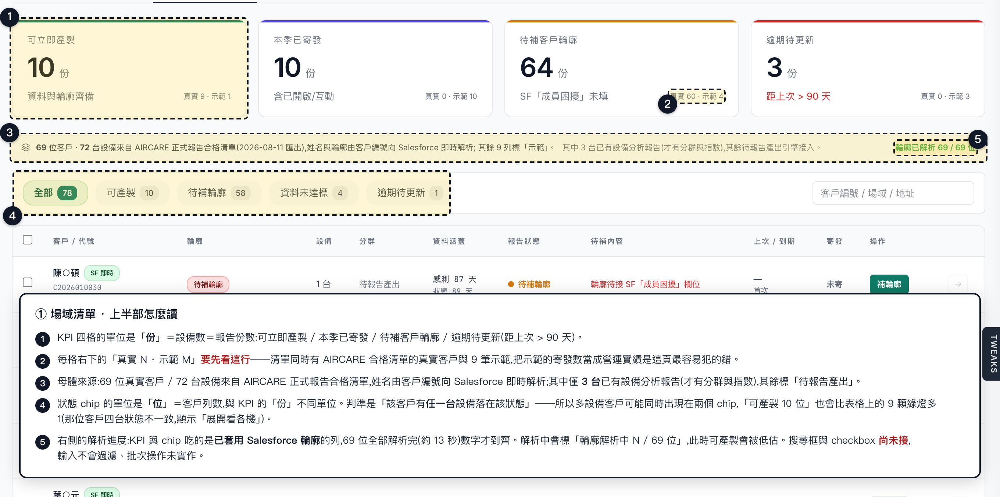
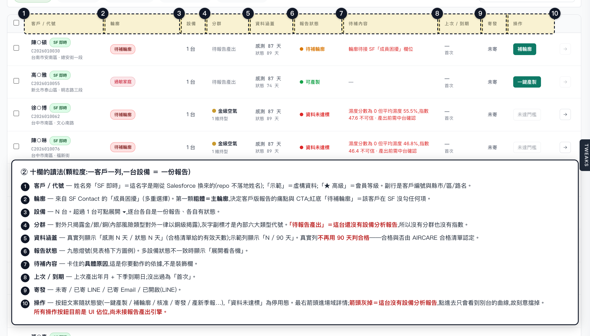
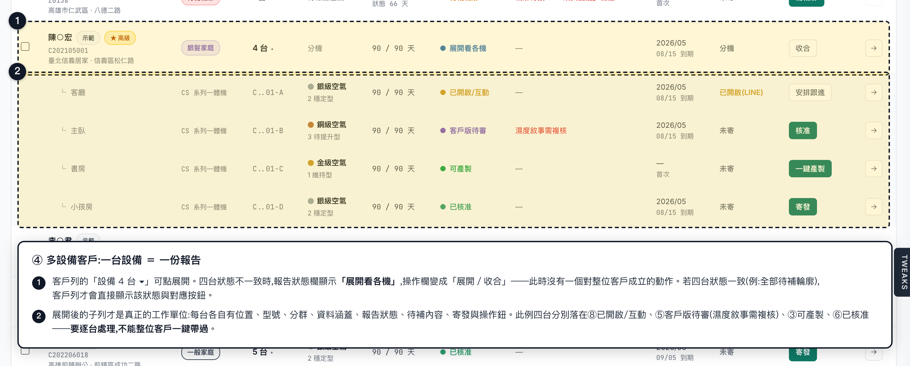
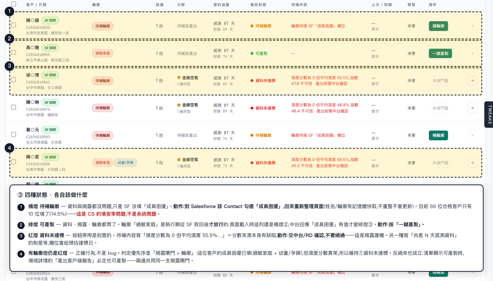

# Module A 場域清單 — 運作邏輯與操作手冊

> 建立：2026-08-13
> 對象：報告產製的操作者（CS／營運）與接手這頁的工程師
> 相關：`docs/module-a-field-list-report-plan.md`（改版計畫）、
> `docs/implementation-notes/module-a-field-list-report-implementation-note.md`（實作紀錄）、
> `docs/ report/AIRCARE報告產製Dashboard_設計規格.md`（§2 揭露原則 / §3 九態 / §4 清單頁）

---

## 一、這頁是什麼

`/module-a` 的第三個主 tab。IA 順序：**設備總覽 → 分類概況 → 場域清單 → 個人場域資訊**。

它不是設備巡檢表，是**報告產製的工作佇列**：一眼看出「誰現在就能出報告、誰卡住、卡在哪、誰該催」。PM2.5／CO₂／坪數這類巡檢數值已移到場域詳情與空氣品質頁。

| 項目 | 值 |
|---|---|
| 顆粒度 | **一客戶一列**；一台設備 = 一份報告，多設備展開成子列 |
| 母體 | 69 位真實客戶（72 台）＋ 9 筆示範 |
| 分頁 | 每頁 20 筆（姓名要逐筆向中台解析，頁太大會等太久） |
| 檔案 | 版面 [AFieldList.tsx](../src/modules/module-a/AFieldList.tsx)、邏輯 [module-a-report.ts](../src/mocks/module-a-report.ts) |



> 截圖為 2026-08-13 的真實執行畫面（前端 :5174 + 中台 :8000，Salesforce 即時資料）。
> **姓名一律遮成「陳○碩」**——真名綁上「過敏家庭／家人生病」屬健康相關個資，不進 repo（AGENTS.md §7）。

---

## 二、資料從哪來（三個來源，缺一種就降級顯示）

```
① AIRCARE 正式報告合格清單（CSV，2026-08-11 匯出）
   src/mocks/eligible-customers.ts
   → 決定「誰在清單上」。出現在這份清單 = 已通過正式報告門檻。
   → 提供：客戶編號、機型、訂單號、感測有效天數、狀態有效天數、縣市/區/路名
   → 姓名、電話、完整門牌一律不落地（AGENTS.md §7）

② 設備分析報告（repo 內，目前只有 3 台）
   src/mocks/devices.ts → getFieldDetail()
   → 提供：七分群（AirCare v2 P×H 矩陣）、AirCare 指數、揭露閘門判定
   → 沒有報告的 69 台：分群顯示「待報告產出」，進場域詳情的箭頭停用

③ Salesforce（執行期即時，經中台 /api/members）
   hooks/useMember360.ts → useMembersByCodes()
   → 提供：姓名、成員困擾（Family_Bothered__c）
   → 解析「全部 69 位真實客戶」（不是只有當頁）：KPI 與 chip 是整份母體的數字，
     只解析當頁會讓它們與表格燈號對不起來
   → 逐筆打中台、同時 4 筆，全部解析完約 13 秒；依傳入順序處理，第 1 頁最先出現
   → 結果進記憶體快取，不寫磁碟；翻頁不重打
   → 中台離線 → 姓名退回客戶編號、輪廓一律「待補輪廓」，清單照常可用
```

**為什麼示範列不查 Salesforce**：9 筆示範場域的編號有些在 SF 真的存在但屬於別人（例 `C201000272`），一併解析會把真人姓名貼到虛構資料上。

---

## 三、狀態怎麼判定（九態）

| # | 狀態 | 燈號 | 操作鈕 |
|---|---|---|---|
| ① | 資料未達標 | 紅 | 未達門檻（**停用**） |
| ② | 待補輪廓 | 橘 | 補輪廓 |
| ③ | 可產製 | 綠 | 一鍵產製 |
| ④ | 內部版已產 | 藍 | 預覽內部版 |
| ⑤ | 客戶版待審 | 紫 | 核准 |
| ⑥ | 已核准 | 綠 | 寄發 |
| ⑦ | 已寄發 | 青 | 查看寄發 |
| ⑧ | 已開啟/互動 | 金 | 安排跟進 |
| ⑨ | 逾期待更新 | 灰 | 產新季報 |

### 真實列（69 位）的判定鏈

```
起點 = 可產製
  ├─ 有設備分析報告？
  │    ├─ 揭露閘門 unverified（濕度分數為 0 但平均濕度 > 0）→ ① 資料未達標
  │    └─ 揭露閘門 blocked（指數 < 75）              → ④ 內部版已產
  └─ 仍是可產製，但輪廓為空                          → ② 待補輪廓

執行期：中台回傳「成員困擾」有值 → applyLiveProfiles() 把 ② 放行到 ③
```

注意兩件事：

1. **真實列不做「90 天」判定。** 合格與否由 CSV 認定，不在前端重算。CSV 的 `sensor_valid_days` 最大只有 87，那是「期間內有效感測天數」，與設備報告 `meta.days` 的「期間日曆天 90」是兩個不同定義，混用會把合格客戶誤判成未達標。
2. **輪廓放行是渲染期發生的**，九態是模組載入時算好的靜態值，那時還沒有 SF 資料。所以你會看到清單先閃「待補輪廓」再變「可產製」——這是正常的。

### 示範列（9 筆）的判定優先序

越前面越優先，且 overlay 覆寫不了前四條：

```
1. 感測天數 < 90            → ① 資料未達標（待補內容寫「尚差 N 天」＋預估達標日）
2. 揭露閘門 unverified      → ① 資料未達標（待補內容用閘門的原因原文）
3. 揭露閘門 blocked         → ④ 內部版已產（「指數 N 未達揭露門檻 75 · 僅出內部版」）
4. 輪廓為空                 → ② 待補輪廓
5. 其餘                     → overlay 手寫的 ③～⑨，預設 ③ 可產製
```

這條優先序的用意：**清單狀態與場域詳情的「產出客戶端報告」按鈕永遠同源**，不會出現「清單說可產製、詳情說不可揭露」。

### 輪廓（客戶版報告的痛點與 CTA 由此決定）

來自 SF Contact 的「成員困擾」`Family_Bothered__c`（多重選擇，分號分隔）：

| SF 選項值 | 輪廓標籤 |
|---|---|
| 家有孕婦/家有新生兒/小孩 | 幼童/孕婦 |
| 家人過敏 | 過敏家庭 |
| 家人生病 | 家人生病 |
| 家有長輩 | 銀髮家庭 |
| 家有寵物 | 寵物家庭 |

多選時取一個**主輪廓**（清單上第一顆、粗體），優先序：
過敏 > 家人生病 > 幼童/孕婦 > 銀髮 > 寵物 > KOL > 一般。
⚠ 這個排序是我方假設，**尚待行銷/CS 確認**。

沒勾任何項 = 空字串 = 待補輪廓。SF 沒有「一般」與「KOL」選項——「一般家庭」只在「有填但對不上任何選項」時出現，「KOL」保留給示範與人工標記。

---

## 四、畫面怎麼讀

### KPI 四格（單位是「份」＝設備數）

可立即產製 · 本季已寄發 · 待補客戶輪廓 · 逾期待更新（距上次 > 90 天）

每格底下都標 **「真實 N · 示範 M」**。看數字前先看這行——把示範的寄發數當成營運實績是這頁最容易犯的錯。

KPI 與 chip 吃的是**已套用 Salesforce 輪廓**的列，所以要等 69 位全部解析完（約 13 秒）數字才到齊。母體說明列右側會顯示進度：解析中標「輪廓解析中 N / 69 位 · KPI 與篩選數字尚未到齊」，此時可產製會被低估；完成後轉綠標「輪廓已解析 69 / 69 位」。

### 狀態 chip（單位是「位」＝客戶列數）

全部 / 可產製 / 待補輪廓 / 資料未達標 / 逾期待更新。
判準是「該客戶**有任一台**設備落在該狀態」，所以多設備客戶可能同時出現在兩個 chip 裡，chip 的數字也可能比表格上同色燈號的列數多——例如「可產製 10 位」對上表格 9 顆綠燈，差的那位是四台狀態不一致、顯示「展開看各機」的客戶。

chip 可與七分群篩選並存（分群篩選由「設備總覽」的建議聯繫客戶卡片點擊帶入，右側有 ✕ 可清除）。

### 十欄

| 欄 | 讀法 |
|---|---|
| 客戶 / 代號 | 姓名旁「SF 即時」= 這名字是剛從 Salesforce 換來的；「示範」= 虛構資料；「★ 高級」= 會員等級 |
| 輪廓 | 第一顆粗體 = 主輪廓；空 = 紅底「待補輪廓」 |
| 設備 | N 台；> 1 台可點展開 ▾ |
| 分群 | 對外只揭露金/銀/銅（風險類型與乾燥對外一律以銅級揭露），灰字副標才是內部七分群代號；「待報告產出」= 這台還沒有設備分析報告 |
| 資料涵蓋 | 真實列「感測 N 天 / 狀態 N 天」；示範列「N / 90 天」 |
| 報告狀態 | 九態燈號；多設備狀態不一致時顯示「展開看各機」 |
| 待補內容 | 卡住的**具體原因**，這是你要動作的依據 |
| 上次 / 到期 | 上次產出年月 + 下季到期日 |
| 寄發 | 未寄 / 已寄 LINE / 已寄 Email / 已開啟(LINE) |
| 操作 | 按鈕文案隨狀態變；① 資料未達標為停用態 |

表格下方是九態圖例，footer 顯示「本頁姓名 N / M 筆即時解析」。



### 多設備客戶

客戶列的「設備 N 台 ▾」可展開。四台狀態不一致時，報告狀態欄顯示「展開看各機」、操作欄變成「展開／收合」——此時沒有一個對整位客戶成立的動作，**要逐台處理**。



---

## 五、操作者怎麼執行

四種狀態各自該做什麼，一張圖看完：



### A. 每日：清可產製的量

1. 進 `/module-a` → 場域清單。
2. 看 KPI 第一格「可立即產製」，注意底下的真實/示範分子。
3. 點 chip **可產製** → 清單只剩綠燈列。
4. 逐列按「一鍵產製」。多設備客戶先展開 ▾，逐台各自是一份報告。
5. 產完的列會往 ⑤ 客戶版待審 移動。

### B. 每日：推進待審與寄發

1. chip 切**全部**，看紫燈（⑤ 客戶版待審）→ 按「核准」。
2. 綠燈（⑥ 已核准）→ 按「寄發」。
3. 金燈（⑧ 已開啟/互動）是業務跟進訊號 → 按「安排跟進」轉給業務。

### C. 處理「待補輪廓」（目前最大的一塊）

橘燈代表資料與揭露都沒問題，**只差 SF 的「成員困擾」沒填**。

1. 點 chip **待補輪廓**，記下客戶編號。
2. 到 Salesforce 該 Contact，填「成員困擾」（可複選）。
3. 回清單**重新整理頁面**（姓名/輪廓有記憶體快取，不重整不會更新）。
4. 該列自動由 ② 變 ③，即可產製。

> 現況：69 位合格客戶只有 **10 位**填了成員困擾（14.5%）。這 10 位以外的 59 位，中台開放欄位也不會放行。**輪廓的瓶頸不在系統，在 SF 的填答率**——這是 CS 要補的資料，不是工程問題。

### D. 處理「資料未達標」（操作者不能自己解）

紅燈且按鈕停用是刻意的。看「待補內容」分辨兩種：

- **「尚差 N 天感測資料」** → 等，欄位會給預估達標日。
- **「濕度分數為 0 但平均濕度 59.5%…」** → 分數來源本身有缺陷，**要中台/RD 確認後才能產報告**。目前 3 台有設備分析報告的真實設備都卡在這裡。不要繞過，這是揭露護欄。

### E. 處理「逾期待更新」

灰燈 = 距上次產出超過 90 天 → 按「產新季報」。

### F. 只看某一類型的客戶

從「設備總覽」的建議聯繫客戶卡片點進來，清單會自動套用該分群篩選；篩選 chip 右側 ✕ 清除。

### G. 進場域詳情

點客戶列任一處，或最右箭頭 → 個人場域資訊 · 場域詳情。
箭頭灰掉不可點 = 這台沒有設備分析報告，點進去只會看到別台的曲線（刻意擋掉）。

---

## 六、目前還沒接上的部分（重要，別當成故障）

| 元件 | 現況 |
|---|---|
| 所有操作按鈕（一鍵產製／核准／寄發…） | **UI 佔位，沒有 handler**。正式版要接報告產出引擎（規格 §9 `GET /reports/dashboard`） |
| 搜尋框「客戶編號 / 場域 / 地址」 | **尚未接**，輸入不會過濾 |
| 表頭與各列的 checkbox | **尚未接**，批次操作未實作 |
| 九態、寄發、上次/到期 | 除了揭露閘門與真實列的資料涵蓋天數之外，**全部是示範 overlay**，不是中台資料 |
| 姓名／輪廓解析 | 逐筆打中台（併發 4），69 筆全部解析完約 13 秒。解析完成前 KPI／chip 會低估可產製，畫面上有進度標示。中台加批次端點 `GET /api/customers?codes=`（規格見 [plan](module-a-field-list-report-plan.md)）後，13 秒可降到一次呼叫，只需換 `useMembersByCodes()` 內部，呼叫端不用改 |
| 「1,284」 | 主 tab 上的數字是母體目標，實際母體是 78 列（69 真實 + 9 示範） |

---

## 七、常見疑問

**Q：為什麼清單只有客戶編號、沒有姓名？**
真實列的姓名不落地在 repo（AGENTS.md §7），要靠客戶編號向中台即時換。顯示「查詢 Salesforce 中…」是還在查；顯示「此編號在 Salesforce 查無對應客戶」是 SF 真的沒這筆或中台離線。

**Q：清單顯示可產製，但點進詳情說不可揭露？**
不該發生——兩邊共用同一支 `reportGateOf()`。若真的出現，是 bug，請回報。

**Q：某客戶拿到輪廓了，狀態卻還是紅燈？**
正確行為。揭露閘門的優先序在輪廓之前（例 `C2026010088` 有輪廓但濕度分數異常，維持 ① 資料未達標）。

**Q：KPI 的數字和 chip 的數字對不起來？**
單位不同：KPI 四格是**設備數/報告份數**，chip 是**客戶列數**。一位客戶四台設備，在 KPI 算 4，在 chip 算 1。

**Q：剛進來時 KPI 的「可立即產製」比較小，過幾秒才變大？**
正常。KPI 與 chip 要等 69 位客戶的「成員困擾」全部從 Salesforce 解析回來才算得準，過程約 13 秒，畫面右上有「輪廓解析中 N / 69 位」的進度。**看到「輪廓已解析 69 / 69 位」轉綠，數字才是最終值。**

**Q：chip 寫「可產製 10 位」，表格只數得出 9 顆綠燈？**
差的那位是多設備客戶，四台狀態不一致，報告狀態欄顯示「展開看各機」而不是綠燈，但它確實有一台是可產製，所以計入 chip。展開就看得到。

**Q：內部後台為什麼顯示全名，規格不是說「○家」？**
「○家」是**對外報告**的規則；內部後台以辨識效率優先（2026-08-13 決定）。開關留在 `MASK_CUSTOMER_NAME`，改一行可切回。真要當隱私邊界，遮蔽必須在中台做。

---

## 附錄：截圖怎麼重新產生

四張標註圖由 [generate-fieldlist-shots.mjs](screenshots/generate-fieldlist-shots.mjs) 產生（Playwright 驅動真實畫面，標註以 overlay 疊上去，不是事後修圖）。畫面改版後重跑即可：

```bash
npm run dev                                   # 前端 :5174
# 另開一個 shell:中台 ~/repos/dataspec/sf-dashboard 需在 :8000
npm i --no-save playwright                    # 專案沒有把 playwright 收進 devDependencies
node docs/screenshots/generate-fieldlist-shots.mjs
```

腳本會等畫面出現「輪廓已解析」才截圖（69 位解析完約 13 秒），否則圖上是解析中的過渡數字。截圖前會把 DOM 裡的姓名遮成「陳○碩」（只動 DOM，不動 `MASK_CUSTOMER_NAME`），所以進 repo 的圖不含真名。中台沒開時清單仍會渲染，但姓名與輪廓會退回未解析狀態，腳本會卡在等待逾時。
