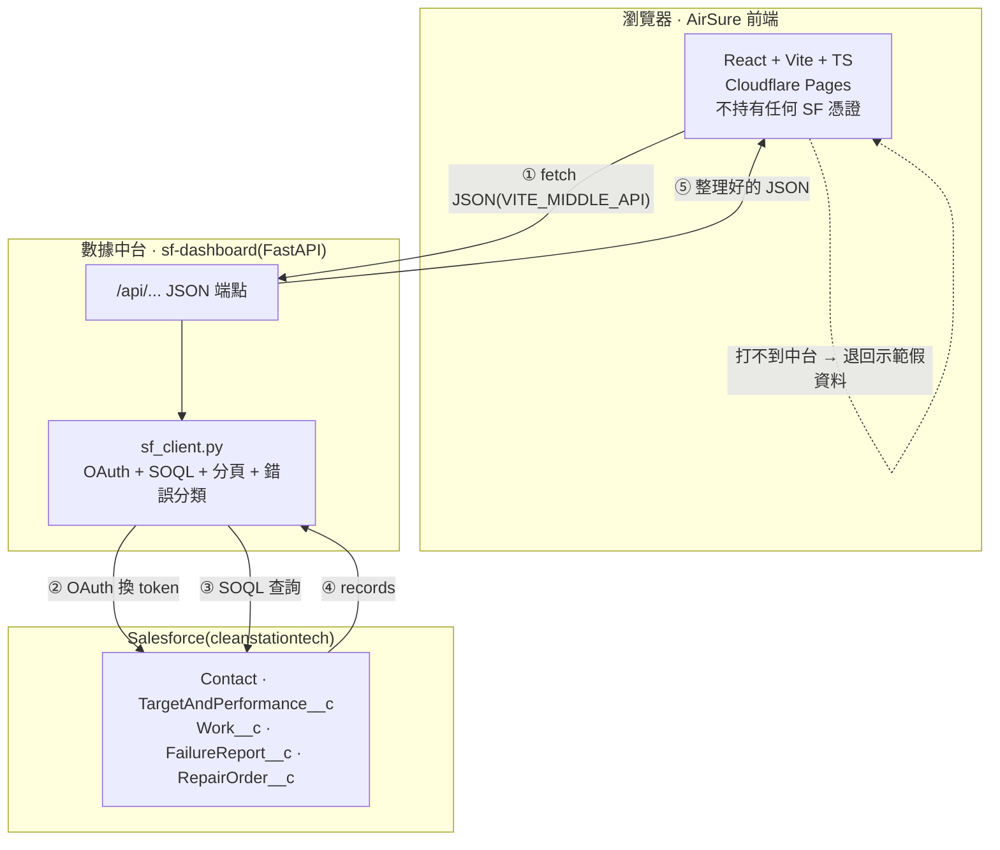
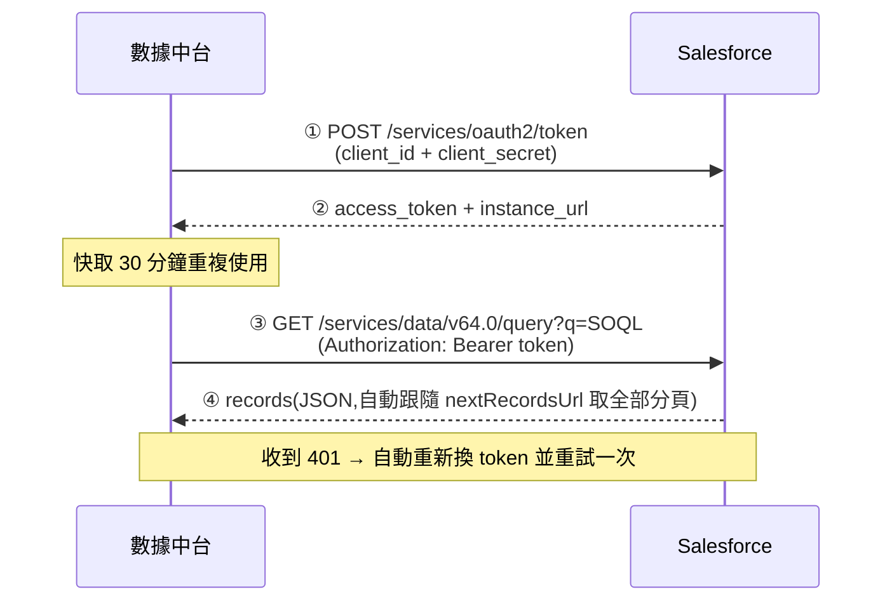
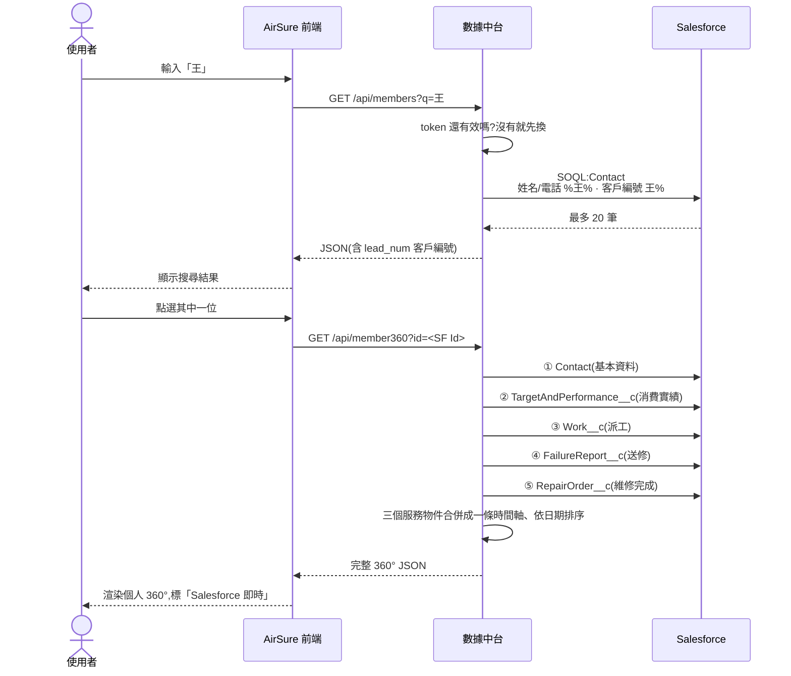

# AirSure × 數據中台 × Salesforce — 串接與工作流說明

> **給誰看**：需要理解「真實資料怎麼進到 AirSure」的人 —— PM、新進工程師、以及要規劃 Dispatch 的人。
> **建立**：2026-09-08 · 內容以中台 `~/repos/dataspec/sf-dashboard` 的實際程式碼為準。
>
> **與其他文件的關係**
> - 《SF串接架構.md》（`~/repos/dataspec/sf-dashboard/docs/`）＝ 串接的權威說明（架構圖 + 上線待辦）。本文不重複它，**專講工作流、決策點與資料流向**。
> - 《AirCare × 數據中台架構關係圖》（本 repo `docs/ report/aircare-architecture_1.md`）＝ 報告產出與對外派送那條線。
> - 《Dispatch 資料模型規格》（本 repo `docs/dispatch-data-model-spec.md`）＝ 寄發事件模型，本文第 8 節說明它與現況的落差。

---

## 1. 先破除一個誤解：沒有「拋轉」

「拋轉」通常指批次把資料從 A 系統倒到 B 系統存起來。**這裡完全沒有這件事。**

中台**沒有資料庫**。它的 `requirements.txt` 只有三個套件：

```
fastapi==0.115.0
uvicorn==0.30.6
httpx==0.27.2
```

沒有任何資料庫驅動。中台是一個**即時查詢代理**：前端問一次，它當場去 Salesforce 撈一次，整理好回傳，然後什麼都不留。唯一的例外是營收的 60 秒記憶體快取。

| | 好處 | 代價 |
|---|---|---|
| 即時查詢（現況） | 資料不會有兩份、不會不同步、沒有排程作業要顧 | 每次查詢都吃 SF API 額度；`member360` 一次跑 5 條 SOQL，首次約 3–6 秒 |

---

## 2. 三層與邊界



**最重要的一條線：憑證只存在中台的 `.env`。**

前端是跑在使用者瀏覽器裡的，任何放進去的密鑰等於公開。所以 AirSure repo 明令不得存放任何 Salesforce 憑證（AGENTS.md §7、§10）。

| 層 | 角色 | 持有憑證？ |
|---|---|:--:|
| AirSure 前端 | 只認識中台的網址（`VITE_MIDDLE_API`） | ❌ |
| 數據中台 | **唯一**持有憑證、**唯一**發 SOQL 的地方 | ✅ |
| Salesforce | 營運資料的唯一真相 | — |

---

## 3. 認證怎麼走，以及一個很容易誤判的坑

用的是 **OAuth 2.0 Client Credentials** —— 「系統對系統」，沒有人要登入。



### ⚠ 坑：權限問題會長得像程式錯誤

**中台看得到什麼，完全取決於 Connected App 綁的「Run-As 使用者」的權限**，不是靠登入的人是誰。

所以當查詢失敗、錯誤碼是這幾個時：

| 錯誤碼 | 真正的原因 | 修法 |
|---|---|---|
| `INVALID_TYPE` | 物件名稱不存在，或 Run-As 使用者沒有該物件的讀取權限 | 去 SF 權限集補上 |
| `INVALID_FIELD` | 欄位不存在，或沒有該欄位的讀取權限 | 同上 |
| `INSUFFICIENT_ACCESS` | Run-As 使用者權限不足 | 同上 |
| `REQUEST_LIMIT_EXCEEDED` | API 額度用完 | 等重置，或加快取／降低刷新頻率 |

**幾乎都不是程式壞了。** `sf_client.py` 已經把這些錯誤碼翻成中文修復提示，就是為了讓人不要往錯的方向查。

---

## 4. 一次完整的請求，走給你看

以「在 Module B 搜尋姓王的會員 → 點進她的 360°」為例：



**注意第 ③④⑤ 步之後的合併排序是在中台做的，不是前端。** 這就帶到下一節的決策點。

---

## 5. 目前已接的三支端點

| 端點 | Salesforce 來源 | 中台做的加工 | 快取 | 前端使用處 |
|---|---|---|:--:|---|
| `GET /api/revenue` | `TargetAndPerformance__c`（`Type__c` 分實績／目標，`Date__c` 認列日） | 約 **10 條 SOQL**：`SUM`、`GROUP BY` 部門／通路／來源、`CALENDAR_MONTH` 逐月 YoY、Top 客戶 | 60 秒 | Module F（`useRevenue`） |
| `GET /api/members?q=` | `Contact` | 姓名／電話 `%q%` 模糊、客戶編號 `q%` **前綴**；回前 20 筆 | 無 | Module B、Module A 場域清單（`useMember360`） |
| `GET /api/member360?id=` | `Contact` + 營收 + **三個服務物件** | 5 條 SOQL；服務紀錄合併排序 | 無（首次 3–6 秒） | Module B（`Member360Live`） |

### 為什麼客戶編號用「前綴」而不是模糊比對

編號是結構化字串。`C2026010088` 的中段 `26010` 對使用者沒有意義，`%q%` 只會把整批同年度客戶都撈進來，而且**無法走索引**。前綴同時支援「輸入完整編號」與「輸入 `C202601` 找同批」兩種用法。

### 客戶編號是唯一的接點

`Contact.LeadNum__c`（客戶編號 C）是 AirCare 設備分析報告 `customer.code` 的來源欄位，也是 **IoT 設備 ↔ Salesforce 會員的唯一接點**。

兩支端點都回傳 `lead_num`，所以前端**不需要在自己的 repo 裡存 Contact Id 或姓名** —— 個資不落地（AGENTS.md §7）。

### Salesforce 的物件分布（容易誤會的地方）

| 資料 | 在哪 | 備註 |
|---|---|---|
| 客戶主檔 | `Contact`（約 187 個自訂欄位） | **`Account` 近乎空殼** |
| 營收 | `TargetAndPerformance__c` | `Type__c` 分「實績／目標」 |
| 派工 | `Work__c` | |
| 送修 | `FailureReport__c` | |
| 維修完成 | `RepairOrder__c` | |
| ~~案件~~ | ~~標準 `Case` 物件~~ | **無資料，不要接** |

---

## 6. 決策點一：新資料要在哪裡處理？

團隊最常需要判斷的地方。判準：

| 情況 | 放哪裡 | 為什麼 |
|---|---|---|
| 要跨多個 SF 物件合併 | **中台** | 前端拼要打 5 次 API，慢且每次都吃額度 |
| 要彙總（SUM／GROUP BY／逐月） | **中台** | SOQL 在資料庫端算，比撈全部回來再算快幾個數量級 |
| 同一畫面要跑多次查詢 | **中台**，包成一支端點 | 減少往返、可整支快取 |
| 只是換顯示格式、排序、篩選已有資料 | 前端 | 不需要為此多開端點 |
| Salesforce 根本沒有的資料（訂閱、LTV、CTA） | 維持 mock | 並在 UI 標「待資料源接入」 |

原則寫在 AirSure 的 AGENTS.md §10 規則 4：**需要新資料時先在中台加端點（SOQL 彙總 + 快取），不要在前端拼湊多次呼叫。**

`/api/revenue` 就是照這個做的：一次呼叫背後跑約 10 條 SOQL，所以特地加了 60 秒快取 —— 不然使用者多按幾次就把 API 額度燒掉。

---

## 7. 決策點二：現在跑在哪一種模式？

有**兩層**降級，四種組合。你看到的畫面取決於落在哪一格：

**第一層在中台** —— `.env` 的 `SF_DEMO_MODE`
- `true`：不連 Salesforce，回中台自己的假資料（不用憑證就能跑起來）
- `false`：連真實 Salesforce

**第二層在前端** —— fetch 打不打得到中台
- 打得到：用回傳值，UI 標「Salesforce 即時」
- 打不到：hook 回傳 `null`，元件退回 AirSure 自己的 mock，UI 標「示範資料」

| | 中台 `SF_DEMO_MODE=false` | 中台 `SF_DEMO_MODE=true` |
|---|---|---|
| **前端連得到中台** | 真實 Salesforce 資料 | 中台的假資料 |
| **前端連不到中台** | AirSure 自己的 mock | AirSure 自己的 mock |

> ⚠ 線上站 `airsure-c3k.pages.dev` **永遠是示範資料** —— 中台只跑在本機 `localhost:8000`，Cloudflare 上的網頁連不到。要看真資料，得本機同時開著中台：
> ```bash
> cd ~/repos/dataspec/sf-dashboard
> .venv/bin/uvicorn app:app --port 8000
> ```

---

## 8. 現在最該知道的兩件事

### 8.1 中台目前沒有任何存取控管

中台程式碼的現況：

```python
app.add_middleware(
    CORSMiddleware,
    allow_origins=["*"],   # MVP 先全開;production 收斂成白名單
    allow_methods=["GET"],
    allow_headers=["*"],
)
```

端點**沒有任何身分驗證**。也就是說 —— **只要能連到那台機器的 8000 埠，就能查任何客戶的姓名、電話、Email、地址。**

現在因為只跑在本機所以還好，但這代表**它絕對不能就這樣部署到公開網路**。《SF串接架構.md》第 6 節把「端點加驗證」「CORS 收斂白名單」「個資保護與稽核」列為 P1 必做，本文同意這個判斷。

### 8.2 Dispatch 需要的能力，中台現在完全沒有

這與《Dispatch 資料模型規格》直接相關。中台程式碼實際清點：

| 項目 | 現況 |
|---|:--:|
| 寫入端點（POST／PATCH／PUT／DELETE） | **0 個** |
| `sf_client.py` 的寫入方法 | **0 個**（全是讀取：`get` / `query` / `count` / `group_by` / `run_report`，加上診斷用的 `userinfo` / `limits` / `api_versions`） |
| CORS 允許的方法 | **只有 GET** |
| 資料庫 | **完全沒有** |

**中台從頭到尾是唯讀的。** 但 Dispatch 要做的事 —— 記錄「這封什麼時候寄出、什麼時候被開啟、哪個 CTA 被點了」 —— 全都是**寫入 + 儲存 + 事件累積**。

這不是加一支端點就好，是中台要長出一個它現在沒有的東西：**一個資料庫，以及寫入路徑**。

所以規劃 Dispatch 時，第一個要決定的其實是：

> **這些事件要存在哪？** 中台加一個資料庫？還是另外建一個服務？

這個決定會影響後面所有排期。

> 順帶一提，這也解釋了為什麼對外報告要用「快照」（架構關係圖的第三層快照牆）—— 本質上就是因為對外報告需要「存下來」，而中台的即時查詢模式做不到。

---

## 9. 待確認的落差

《AirCare × 數據中台架構關係圖》寫「分群引擎：**八分群** `sensor_data.py`」，但：

- AirSure 程式碼現在是 **AirCare v2 的七分群**（2026-09-03 commit `eea8a1a` 對齊）
- 在 `~/repos/dataspec` 底下**找不到 `sensor_data.py` 這個檔案**

可能是分群引擎在別的地方（IoT 廠商？）或還沒建。**建議與中台確認** —— 如果兩邊分群規則不同，報告上的等級會跟 AirSure 畫面上的分群對不起來。

---

## 附：相關檔案位置

| 內容 | 路徑 |
|---|---|
| 中台主程式 / SF 用戶端 | `~/repos/dataspec/sf-dashboard/app.py`、`sf_client.py` |
| 中台串接權威文件 | `~/repos/dataspec/sf-dashboard/docs/SF串接架構.md` |
| 環境變數範本（**不含實際憑證**） | `~/repos/dataspec/sf-dashboard/.env.example` |
| 連線自我檢測 | `~/repos/dataspec/sf-dashboard/selftest.py`、`/api/diagnostics` |
| 前端 hooks | `src/hooks/useRevenue.ts`、`src/hooks/useMember360.ts` |
| 欄位／物件對照 | `~/repos/dataspec/客戶主檔_Salesforce欄位對應.md` |
| 主鍵決策 | `~/repos/dataspec/決策_客戶編號永久不變.md` |
